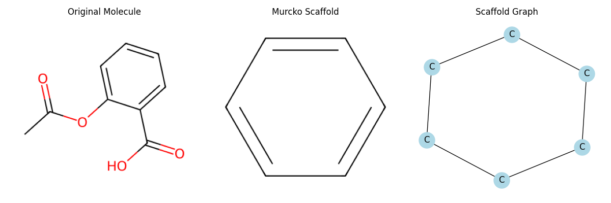
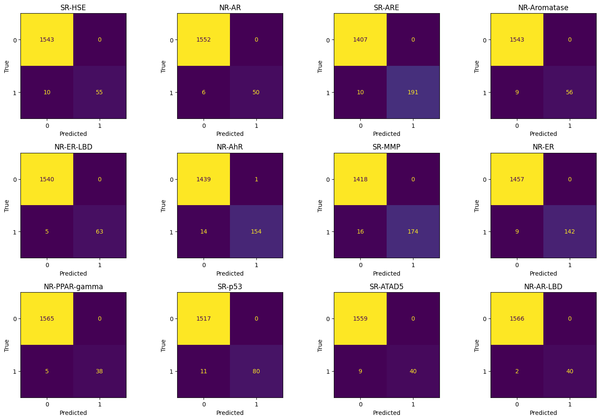
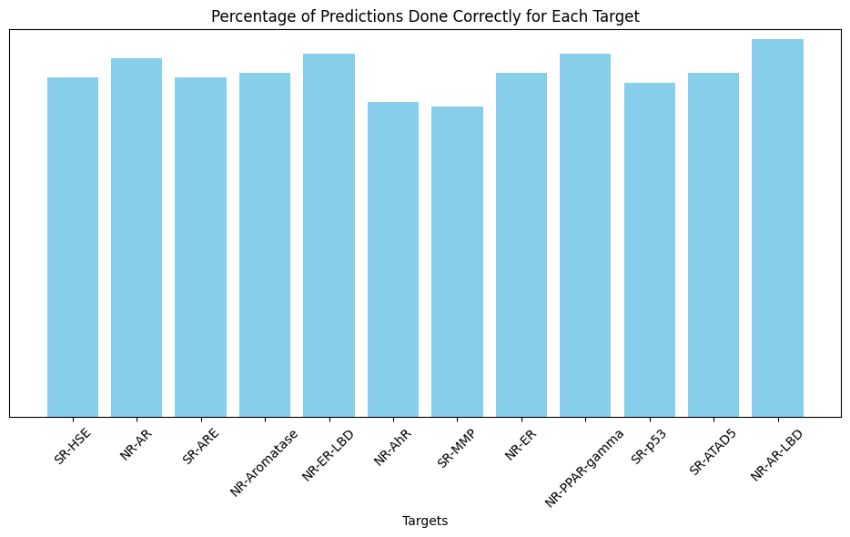

# Tox21

This repository is a Machine Learning project that tackles the Tox-21 data challenge in its simplified version, the data can be obtained from its webpage:

https://tripod.nih.gov/tox21/challenge/data.jsp

In this repository a Machine Learning model is created to predict the response panel of 12 toxicity endpoints in drug-related molecules done making feature creation and engineering using computational chemistry libraries.

## Table of contents
- [Files](#Files)
- [Data](#Data)
- [Project outline](#project-outline)
- [How to run](#how-to-run)
- [Results](#results)
- [Dependencies](#dependencies)

# File hierarchy

<pre><code> Root/ ├── folder1/ │ ├── file1.txt │ └── file2.txt ├── folder2/ │ ├── subfolder1/ │ │ └── file3.txt │ └── file4.txt └── file5.txt </code></pre>


# Data

The used data consists on SMILES representations of 8039 molecules along with the experimental response panel. For illustration the last five rows of the dataframe are:

 | SMILES                                |   SR-HSE |   NR-AR |   SR-ARE |   NR-Aromatase |   NR-ER-LBD |   NR-AhR |   SR-MMP |   NR-ER |   NR-PPAR-gamma |   SR-p53 |   SR-ATAD5 |   NR-AR-LBD |
|---|---|---|---|---|---|---|---|---|---|---|---|---|
| CCCc1cc(=O)[nH]c(=S)[nH]1             |        0 |       0 |        0 |              0 |           0 |        0 |        0 |       0 |               0 |        0 |          0 |           0 
| S=C1NCCN1                             |        0 |       0 |        1 |              0 |           0 |        0 |        0 |       0 |               0 |        0 |          0 |           0 |
| S=C1NCCN1                             |        0 |       0 |        0 |              0 |           0 |        0 |        0 |       0 |               0 |        0 |          0 |           0 |
| CCOP(=S)(OCC)Oc1ccc([N+](=O)[O-])cc1  |        0 |       0 |        0 |              0 |           0 |        1 |        0 |       0 |               0 |        0 |          0 |           0 |
| CCC(COC(=O)CCS)(COC(=O)CCS)COC(=O)CCS |        0 |       0 |        0 |              0 |           0 |        0 |   0 |       0 |               0 |        1 |          0 |           0 |


A SMILES (Simplified Molecular Input Line Entry System) representation refers to a "short" ASCII string that represents the structure of a chemical species. For instance the SMILES CCC(COC(=O)CCS)(COC(=O)CCS)COC(=O)CCS represents


# Project outline

**Dataset generation** The `DataLoader.py` script contains a class to generate the dataset using the `tox21_all_data_10k.sdf` as baseline, the script implements methods to do the following actions:
 * Reformat the molecular weight column to work with numbers.
 * Change types to floats.
 * Duplicates elimination: The tox21 dataset is a experimental dataset so duplicate SMILES are often found and it is common to have NaNs if the experiment for that receptor was not done, when a duplicate is found the following process is followed (This method is based on the original challenge specifications):
    - Case NaN vs number -> number remains
    - Case 1 vs 0 -> 1 remains
        
**Exploratory data analysis** which can be found on `EDA.ipynb` serves the purpose of finding an initial description of the data we are working with.

**Preprocessing** which can be found on `Preprocess.py` is a script that prepares the data in order to train the model doing the following actions:
 * Scaffolding molecules: Retrieval of the most important part of the molecule.
 * Converting molecules to graphs: Taking into account that biomolecules can be thought as graphs where atoms are the nodes and bonds are the vertices the `RdKit` and `networkx` libraries are used to convert SMILES to graphs.
 * Embed nodes: Utilization of `node2vec` to generate biased random walks along the graph.
 * Extracting graph features: Using `networkx` the average degree, density, clustering coefficient and diameter of each graph was extracted.
 * Molecular descriptors: Using `rdkit` to extract the Molecular weight, partition coefficient, number of Donor and acceptor hydrogens and molecular polar surface area of each molecule.
 * Fingerprints: Extracted molecular fingerprints using Morgan and MACCS algorithms.



**Training** The training located at `train.py` loads the data, imputes the missing columns using `IterativeImputer` from sklearn and fits a multioutput `XGBClassifier`, due to the excessive data imbalance every class weight is calculated and manually assigned to each estimator to ensure a better fit.

# How to run 

First train the model which will be stored as `models/model.pkl`
```sh
python train.py
```
**Note: Given that the script has to generate the all of the features it could take a long time to run, for instance in a 12 core machine running a ryzen 5 7600X it takes 55 minutes to load.


Then you can make predictions running
```sh
python predict.py "{smiles}"
```
replacing {smiles} with an actual SMILES string

For instance running predict on "Nc1ccc(C(=O)Nc2ccccc2N)cc1" yields:
```sh
Predicted toxicity of the molecule Nc1ccc(C(=O)Nc2ccccc2N)cc1:
SR-HSE:Inactive
NR-AR:Inactive
SR-ARE:Inactive
NR-Aromatase:Inactive
NR-ER-LBD:Inactive
NR-AhR:Inactive
SR-MMP:Active
NR-ER:Active
NR-PPAR-gamma:Inactive
SR-p53:Inactive
SR-ATAD5:Inactive
NR-AR-LBD:Inactive
```

# Results

The dataset was tested with a train validation, test split of 70%, 20%, 10% cross-validated with 5 stratified folds, the final confusion matrices on the test set was:



Not every class performs equally, to illustrate:



| Endpoint           | F1-Score |
|--------------------|----------|
| SR-HSE            | 0.9567   |
| NR-AR             | 0.9707   |
| SR-ARE            | 0.9855   |
| NR-Aromatase      | 0.9614   |
| NR-ER-LBD         | 0.9801   |
| NR-AhR            | 0.9742   |
| SR-MMP            | 0.9752   |
| NR-ER             | 0.9831   |
| NR-PPAR-gamma     | 0.9683   |
| SR-p53            | 0.9660   |
| SR-ATAD5          | 0.9480   |
| NR-AR-LBD         | 0.9875   |


# Dependencies

pandas - 2.2.3

numpy - 1.26.4

rdkit - 2024.03.6

scikit-learn - 1.5.2

pickle - 4.0

node2vec - 0.5.0

colorama - 0.4.6

You can install them running:
```sh
pip -r requirements.txt
```